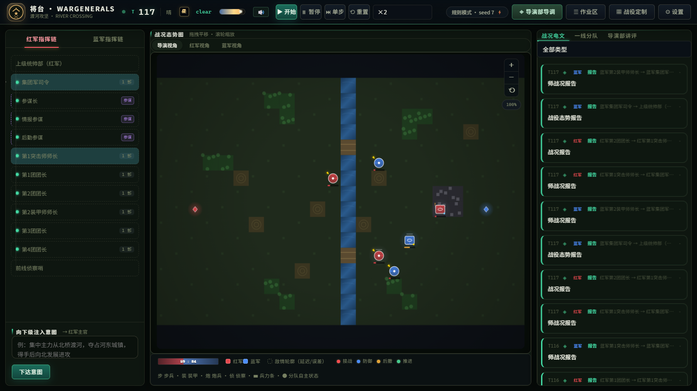

# WARGENERALS (将台)

> **A multi-agent wargame that simulates military command chains** — not how units
> fight, but how organizations command, coordinate, and report under friction.
> Built with Python, FastAPI, and pluggable LLM agents.

<p align="center">
  <strong>Study how a military organization turns a commander's intent into orders,
  executes them under latency and loss, and reports back — the map is the backdrop;
  the organization is the simulation.</strong>
</p>

<p align="center">
  English | <a href="README.zh-CN.md">简体中文</a> | <a href="README.ja-JP.md">日本語</a>
</p>

<p align="center">
  <a href=".github/workflows/ci.yml"></a>
  
  
  
  
</p>

<p align="center">
  <strong>Topics:</strong>
  <code>wargame</code> · <code>multi-agent</code> · <code>llm</code> · <code>command-and-control</code> ·
  <code>military-simulation</code> · <code>ai-agents</code> · <code>mission-command</code> ·
  <code>organizational-friction</code> · <code>stalingrad</code> · <code>normandy</code> · <code>fastapi</code>
</p>

## Screenshot

<p align="center">
  
</p>

The command console is a single dark COP-style page — the live tactical map in
the center, the command chain on the left, and the message feed / after-action
review panel on the right.

## Table of contents

- [Screenshot](#screenshot)
- [Why WARGENERALS](#why-wargenerals)
- [Highlights](#highlights)
- [Quick start](#quick-start)
- [Scenarios](#scenarios)
- [Using the web console](#using-the-web-console)
- [The command & control model](#the-command--control-model)
- [LLM mode](#llm-mode)
- [Headless CLI](#headless-cli)
- [Campaign mechanics](#campaign-mechanics)
- [After-action & replay](#after-action--replay)
- [Settings panel](#settings-panel)
- [Architecture](#architecture)
- [Development](#development)
- [FAQ & troubleshooting](#faq--troubleshooting)
- [Contributing](#contributing)
- [License](#license)

## Why WARGENERALS

Most wargame projects simulate the battlefield. WARGENERALS simulates the **command
machine behind it**: how an intent from high command is decomposed layer by layer
into orders, how subordinates execute and report back, how peers coordinate, and
how information decays under latency and loss. The map is a backdrop; the
organization is the simulation.

```
Intent (HQ) → Plan (staff) → Orders (army→division→regiment) → Actions (engine) → Reports (upward)
     ▲                                                                                │
     └─────────────── latency · loss · distortion (organizational friction) ─────────┘
```

Every faction is a **closed loop**: it only knows what its own reports have told it,
sees the enemy only through its own reconnaissance, and its orders arrive late or
get lost when communication is degraded. You are not steering units directly — you
are watching (and, as the *director*, perturbing) an organization that must run itself.

## Highlights

**The command machine**

- **Multi-faction by design** — any number of factions with explicit *war relations*
  (`WAR_PAIRS`): allied factions can stand adjacent without firing at each other.
  Normandy runs three factions (US / UK-Canada / Germany), each with its own command
  chain, intelligence and score.
- **Isolation is enforced, not promised** — each faction has its own message bus,
  intel store and memory. Cross-faction messages raise at the bus layer. Even inside
  one faction, agents share nothing: a corps commander knows exactly what his
  subordinates reported, nothing more.
- **Agents with character** — every position carries a scenario-defined personality
  ("Montgomery-style caution", "fanatic 12th SS", "delayed German high command that
  hoards its panzer reserve"), injected into LLM role cards, with per-position
  behavior overrides (e.g. alert thresholds).
- **Organizational friction as a knob** — message latency, loss rate and electronic
  jamming are live parameters: watch commanders decide on late, incomplete
  information, and lose key orders to jamming.
- **Tactical agents at the front line** — every combat unit is bound to a lightweight
  tactical agent with local perception, autonomous action (engage on contact, withdraw
  when hurt, hold in place) and asynchronous reporting. The bottom of the command
  chain is AI-driven, not dead data.

**The deterministic engine**

- **Deterministic engine, LLM only decides** — movement, attrition, supply,
  reconnaissance, weather, air interdiction, depot capture and objectives are all
  resolved by a seeded, reproducible engine (same seed ⇒ same battle). LLMs (or a
  rule fallback) only emit typed messages and orders; hallucinated orders are
  rejected by schema checks.
- **Nine battlefield factors** — day/night, fatigue & rest, morale & breakdown,
  electronic warfare, artillery suppression, supply lines (ammo/fuel/rations), fog of
  war & camouflage, command radius, combined-arms synergy, engineering &
  fortification, weather effects, unit experience, commander traits, march/deployment
  formations — all interacting in the combat formula.

**The command console (web UI)**

- **COP-style command center** — NATO-style unit symbols, procedural terrain
  textures, combat effects (explosions, artillery trajectories, fire lines), unit
  selection & detail panels, hover tooltips, force-ratio bars, and day/night progress.
- **Campaign briefing** — every scenario ships an operational briefing shown before
  play; the engine emits a command summary (weather / objective control / force
  ratios) every 5 ticks.
- **Director console (导演部)** — inject any situation mid-run (new orders, enemy
  concentration, weather shift, intel leak) into any position, or write a *director
  script* that fires automatically at chosen ticks.

**LLM & after-action review**

- **AI scenario import** — paste battle material (a history article, OOB notes, news);
  an LLM classifies it into factions, units, objectives and intents, and the scenario
  becomes playable from the lobby.
- **After-action metrics & replay** — live per-faction command health, strength /
  score / objective-control curves, a Markdown after-action report, and a JSONL event
  log under `runs/*/events.jsonl` for offline replay.
- **Stalingrad scenario** — urban attrition with the Volga and the railway station as
  the prizes: a snowstorm → overcast → clear weather script, street fighting, and
  scripted reinforcements for both sides.

## Quick start

Requires **Python 3.10+**. No LLM key needed to run — the built-in rule policy is
fully offline and deterministic.

```bash
# 1. install
python -m venv .venv
source .venv/bin/activate        # Windows: .venv\Scripts\activate
pip install -e .

# 2. launch the web console
python -m wargame.cli serve      # → http://127.0.0.1:8300
```

Open the console, pick a scenario in the lobby, read its briefing, and start the
exercise. To enable LLM-based decisions, set the keys in the **Settings** panel or a
`.env` file — see [LLM mode](#llm-mode).

## Scenarios

| Scenario | id | Description |
|---|---|---|
| River Crossing | `cross_river` | Fictional training scenario: two bridges as bottlenecks, organizational friction front and center |
| Normandy 1944 | `normandy` | Three-faction historical scenario: five-beach landing vs the Atlantic Wall and the panzer reserve |
| Stalingrad 1942 | `stalingrad` | Two-faction urban attrition: the Volga and the railway station, snowstorm → overcast → clear script, scripted reinforcements |

Scenarios are plain data modules under `src/wargame/scenarios/`. They export a
unified interface (`SCENARIO_NAME`, `build_world()`, `FACTIONS`, `WAR_PAIRS`,
`DEFAULT_INTENTS`, `PLANS`, `RECON_TARGET`, plus optional `CAMP_NAMES`, `ORG_TITLES`,
`ORG_CONFIG`, `WEATHER`, `AIR_POWER`, `OBJECTIVES`, `REINFORCEMENTS`, `BRIEFING`),
get registered with one line in `scenarios/__init__.py`, and appear in the lobby.
See [Development](#development) for the recipe.

## Using the web console

The console is a single dark command-center page with two modes:

**Lobby** (想定库 / roster / director / debug views, left nav):

- **Scenario library (想定库)** — browse scenarios, read briefings, import AI
  scenarios, and tune campaign parameters.
- **Order of battle (兵力编成)** — inspect every position's role, authority and
  per-position behavior overrides.
- **Director (导演部设定)** — set each faction's opening intent, tune organizational
  friction, and author director scripts.
- **Agent debug (智能体调试)** — live-inspect every agent's inbox, tasks, memory and
  decision history; replay raw LLM request/response pairs; export the full run as
  JSON or a Markdown after-action report.

**Deck (指挥台)** — the live exercise:

- **Map** — pan/zoom canvas with NATO-style symbols, procedural terrain, combat
  effects, day/night dimming, and a force-ratio bar.
- **Message feed (战况电文)** — every message in the chain (intent → plan → order →
  ack → sitrep → request → escalation → intel), color-coded and filterable.
- **Front-line units (一线分队)** — each tactical agent's state and recent actions.
- **Review panel (导演部讲评)** — live command-health stats plus strength, score and
  objective-control curves; export a Markdown after-action report.

## The command & control model

- **Mission command (任务式指挥)** — orders carry intent, not step-by-step tactics;
  subordinates choose the how, and report back through the chain.
- **Message kinds** — `intent` (upper intent), `plan` (staff proposal), `order`
  (command down), `ack` (confirmation up), `sitrep` (situation report up),
  `request` / `escalation` (asking up), `intel` (intelligence broadcast).
- **Friction** — every message travels the bus with configurable latency, loss rate
  and electronic jamming; priority messages are partially protected, simulating
  military redundant channels.
- **Isolation** — one bus, one intel store and one memory per faction; nothing crosses
  except through the shared world engine (and enemy fire).
- **Director** — inject situations into any position at any time, or script them to
  fire at chosen ticks. The exercise is a moving experiment you can perturb.

## LLM mode

With `LLM_API_KEY` set, agents decide via any OpenAI-compatible endpoint using native
**tool calls** (structured output); on failure they gracefully fall back to a JSON
prompt path, then to the deterministic **rule policy**. All switchable via env vars:

| Variable | Default | Meaning |
|---|---|---|
| `LLM_API_KEY` | *(empty)* | API key. Empty ⇒ rule policy (offline). Never commit it. |
| `LLM_BASE_URL` | `https://api.openai.com/v1` | Any OpenAI-compatible endpoint (OpenAI / DeepSeek / Qwen / Ollama …) |
| `LLM_MODEL` | `gpt-4o-mini` | Model id |
| `WARGAME_LLM_TOOLS` | `1` | Use native tool-call structured output; `0` = JSON prompt path |
| `WARGAME_LLM_RETRY` | `2` | Retries per request (with exponential backoff) |
| `WARGAME_LLM_TIMEOUT` | `90` | Per-request timeout, seconds |
| `WARGAME_MAX_LLM_CALLS` | `40` | LLM calls allowed per tick (budget guard) |
| `WARGAME_LLM_FALLBACK` | `1` | Auto-fall back to rule policy on failure; `0` = surface errors instead |
| `WARGAME_LLM_TOP_P` | `1` | Nucleus sampling |
| `WARGAME_LLM_FREQ_PENALTY` / `WARGAME_LLM_PRESENCE_PENALTY` | `0` | Sampling penalties |
| `WARGAME_SEED` | `7` | World RNG seed (same seed ⇒ same battle) |

Any of these can be set in a `.env` file next to the working directory, in the web
**Settings** panel, or as environment variables. Each LLM decision is captured in the
trace (prompt, response, latency, attempts) and viewable in the agent debug center.

## Headless CLI

```bash
# Run a battle headlessly (rule policy by default), print a human log, save events.jsonl
python -m wargame.cli run --scenario normandy --ticks 40
python -m wargame.cli run --scenario stalingrad --ticks 60 --policy llm --seed 7

# Serve the web console on a custom port
python -m wargame.cli serve --host 127.0.0.1 --port 8300
python -m wargame.cli serve --scenario stalingrad
```

Flags: `--ticks N`, `--policy auto|rule|llm`, `--seed N`, `--scenario <id>`,
`--no-intents` (skip default intents).

## Campaign mechanics

**Normandy 1944** — 44×30 map with terrain (bocage, hills, rivers & bridges, marsh
that slows armor, rail/road corridors); scripted weather (the June 6 storm grounds
the air forces, as it did historically); air interdiction that strafes moving enemy
units; a reinforcement schedule (101st Airborne, British 51st Highland, 12th SS,
Panzer Lehr) that attaches to named commanders; supply depots that can be captured and
feed the *enemy*; victory cities scored live.

**Stalingrad 1942** — a dense 20×14 urban grid where the Volga cuts the eastern flank
and the railway station is the key objective; streets act as movement corridors, ruins
give cover, urban movement is slower; weather moves snowstorm → overcast → clear
through the exercise; both sides receive scripted reinforcements (Soviet Guards
infantry, German 6th Army reserve).

## After-action & replay

- **Live metrics (right panel)** — per faction: orders issued, acknowledgement rate
  and delay, sitreps, requests, escalations, intel, decision counts, message losses,
  isolation blocks, LLM fallbacks, remaining strength and objective scores.
- **Review curves** — strength, score and objective-control timelines drawn live.
- **After-action report** — the debug center exports a Markdown report (overview,
  command-chain health, objective-control timeline, key events) summarizing the whole
  exercise.
- **Event log & replay** — every event lands as JSONL in `runs/<run>/events.jsonl`;
  `src/wargame/replay.py` rebuilds a run from that log for offline analysis (skips
  corrupt lines), and is the same pipeline behind the after-action report.

## Settings panel

Live-tunable in the web UI: combat strength, artillery power, entrenchment bonus,
terrain defense, supply rate & radius, recon scale, intel error, move speed, reporting
cadence, message latency & loss (friction), LLM temperature and per-tick budget.
Engine defaults live in `DEFAULT_TUNING` (`src/wargame/engine/world.py`).

## Architecture

```
src/wargame/
├── schemas.py        protocol: messages (8 kinds) / world actions / decisions
├── org.py            ORBAT: position = agent (role card + authority + config)
├── bus.py            faction bus: latency delivery + isolation checks + friction
├── camps.py          faction container: bus + agents + intel store
├── sim.py            scheduler: deliver → decide → engine → recon, JSONL event log, metrics history
├── replay.py         JSONL replay loader + Markdown after-action report builder
├── agents/
│   ├── base.py       Agent: mailbox + tasks + memory + SituationView (scoped view)
│   ├── rule_policy.py  rule brain (offline, deterministic, LLM fallback)
│   ├── llm_policy.py   LLM brain (role card + situation → tool-call / JSON decision)
│   └── tactical.py    per-unit front-line agents (perception + autonomous action)
├── engine/world.py   deterministic engine: movement/melee/arty/supply/recon/
│                     weather/air interdiction/depots/objectives/fatigue/morale
├── scenarios/        cross_river / normandy / stalingrad / dynamic (AI-imported)
└── web/              FastAPI (REST + SSE) + dark command-center frontend (no build step)
```

Per tick the simulator runs: **deliver** (friction-delayed mail) → **decide** (each
woken agent produces messages & orders) → **engine** (movement/combat/supply/weather…)
→ **recon** (intel flows into each faction's own store). All events stream to the
browser over SSE and are appended to `runs/*/events.jsonl`.

> The Python package name is `wargame` (import path); the distribution is
> `wargenerals`; the brand is **WARGENERALS (将台)**. The repo keeps a historical
> layout; a future major version may unify folder names.

## Development

```bash
python -m pytest -q            # 47 tests: command chain, isolation, determinism, scenarios, LLM paths, replay
python -m ruff check src tests # zero warnings
```

**Add a scenario** — create `src/wargame/scenarios/<name>.py` exporting the unified
interface (see [Scenarios](#scenarios)), register it in `scenarios/__init__.py`, add a
smoke test in `tests/`, run the suite. **Add a position/mechanic** — the engine is
deterministic and seeded; keep randomness out of agents so battles stay reproducible.

## FAQ & troubleshooting

- **Nothing happens without an LLM key** — by design: the rule policy runs the full
  loop offline. Set `LLM_API_KEY` to switch agents to LLM decisions.
- **LLM decisions look wrong or the exercise stalls** — set `WARGAME_LLM_FALLBACK=0`
  to surface the underlying error instead of silently falling back; check
  `LLM_BASE_URL`/`LLM_MODEL`; the raw request/response is visible in the agent debug
  center.
- **Port 8300 is taken** — use `python -m wargame.cli serve --port <other>`.
- **Chinese output garbled in the terminal** — the CLI forces UTF-8; use a UTF-8
  terminal on Windows (e.g. `chcp 65001`).
- **Same seed, different result?** — ensure the same policy mode; rule and LLM modes
  are different policies by design.

## Contributing

Issues and PRs welcome. Before submitting: `python -m pytest -q` green, `ruff check`
clean, add smoke tests for new mechanics/scenarios, write code comments in Chinese
explaining *why*, and **never commit** `.env`, API keys or tokens (a CI secret-leak
scan will fail the build). See [CONTRIBUTING.md](CONTRIBUTING.md) and
[SECURITY.md](SECURITY.md).

## License

[MIT](LICENSE) © 2026 Wargenerals Contributors
